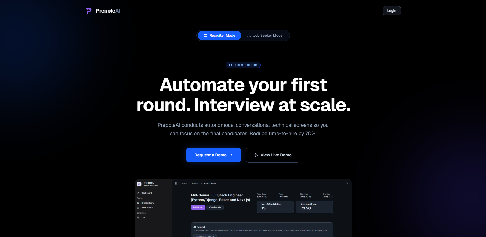

# Prepple AI

Prepple AI is a web application designed to simplify and automate the HR interview process. It acts as an additional layer in the hiring process by using AI to conduct initial screening interviews.

## Overview

The platform generates a meeting link where a job seeker can join and be interviewed by Prepple's AI HR agent autonomously. After the interview, Prepple prepares a summary report for HR managers, which includes performance metrics, tone analysis, and an evaluation of the candidate's performance. This helps HR companies that handle hundreds or thousands of interviews efficiently filter and select potential candidates.

## Core Features

### HR User Features
- **Generate Prepple Room**: Create a unique AI interview session and link.
- **Input Job Posting and Interview Type**: Define the context for the interview (General or Technical).
- **AI Configuration**: Customize the AI's tone, language, or company-specific voice.
- **Dashboard View**: Monitor candidate performance, view AI-generated reports, and sort candidates by score.
- **Multiple Room Management**: Support for creating and managing several simultaneous interview sessions.
- **Analytics**: View statistics, candidate trends, and performance averages.

### Candidate Features
- **Join Prepple Room**: Participate in an AI-led interview via a shared link.
- **AI Voice Interaction**: Interact with the AI agent using voice.
- **Profile Management**: Candidates can sign in and input their CV/Resume.
- **Performance Summary (Pro)**: View detailed feedback and insights after the interview.
- **Practice Rooms (Pro)**: Conduct mock interviews to prepare.
- **Interview History (Pro)**: Access past interviews and insights.

## Technology Stack

- **Full Stack Framework**: Next.js
- **Backend & DB**: Supabase for Auth, Database (PostgreSQL), and Storage
- **Voice & AI Layer**: LiveKit for the voice agent layer and WebRTC, integrated with Gemini Live API
- **Frontend Tools**: Tailwind CSS, ShadCN, and Zod

## Getting Started

### Prerequisites

- Node.js
- Supabase project

### Installation

1. Clone the repository:
   ```bash
   git clone <repository-url>
   cd prepple-ai
   ```

2. Install dependencies:
   ```bash
   npm install
   ```

3. Set up environment variables:
   Rename `.env.example` to `.env.local` and update with your Supabase and LiveKit credentials.

4. Run the development server:
   ```bash
   npm run dev
   ```

   Open [http://localhost:3000](http://localhost:3000) with your browser to see the result.
